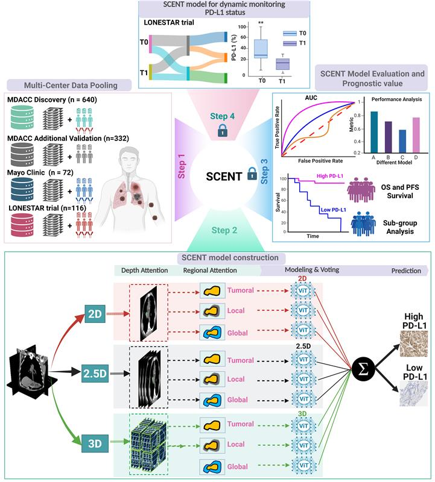
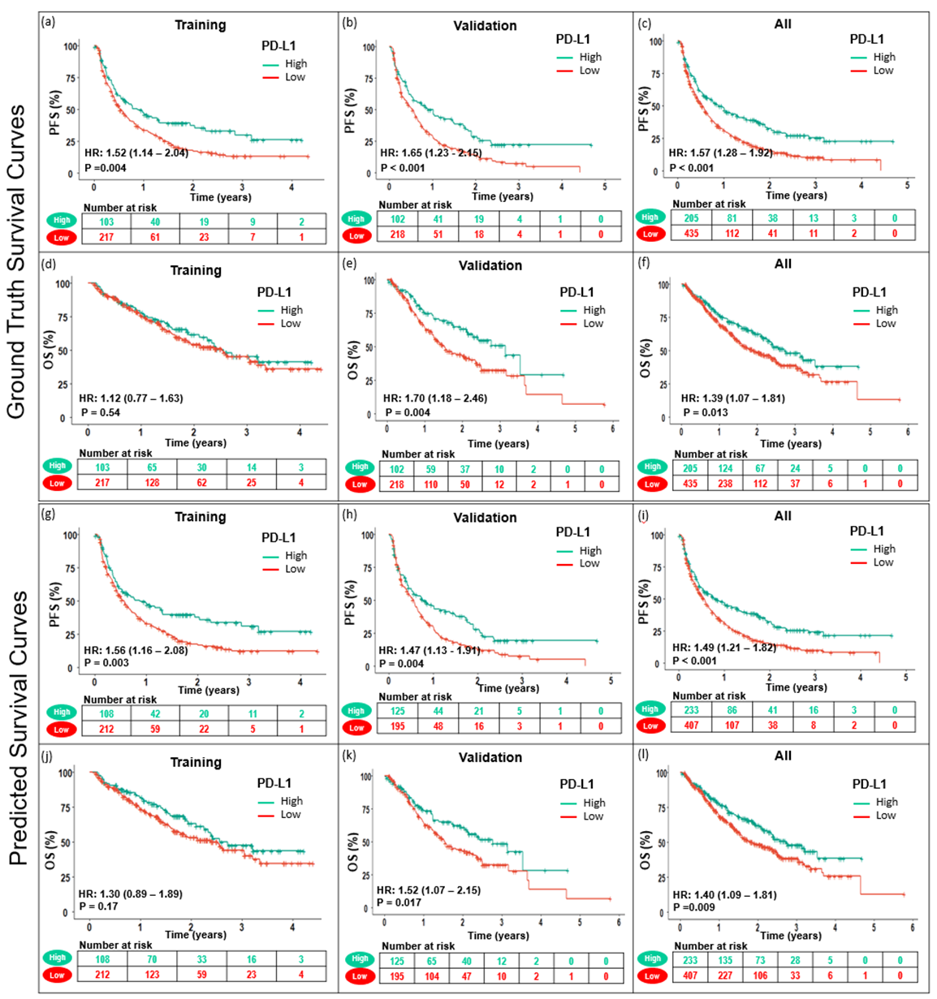

# SCENT: A Deep Learning Framework for PD-L1 Expression Prediction using CT Imaging

**SCENT** (Scalable Ensemble Transformer) is a CT-based deep learning framework that non-invasively predicts PD-L1 expression (≥50% vs <50%) and serves as a biomarker for immunotherapy outcomes in metastatic NSCLC. Trained on paired PD-L1 IHC and CT scans and validated across independent ICI-treated cohorts, SCENT complements tissue IHC while enabling scalable “virtual biopsy” and longitudinal monitoring of treatment response.



## Key Features
- **Non-Invasive PD-L1 Prediction**: Accurately classifies PD-L1 status across biopsy site (AUC=0.84; specificity=83.9%, sensitivity=85.3%).
- **Ensemble Transformer Architecture**: Scalable model design tailored for clinical CT imaging with robust internal validation.
- **Clinical Utility**: SCENT-derived PD-L1 stratifies outcomes—PFS (HR=1.49, p<0.001) and OS (HR=1.40, p=0.009), comparable to IHC-based PD-L1.
- **Joint Stratification with IHC**: Complementary value when combined with tissue IHC; concordant low–low group has the worst outcomes (OS HR=1.45, p=0.008).
- **External Validation**: Generalizes to independent cohorts (AUC=0.80 in Mayo; AUC=0.78 in LONESTAR).
- **Longitudinal Monitoring**: In LONESTAR, baseline and 3-month CTs show dynamic SCENT-predicted PD-L1 shifts aligning with clinical response (odds ratio=0.14; Fisher’s exact p=0.054).

## Installation
To install the **development version** of I-SABR-SELECT using `pip`, run the following command:

```bash
pip install git+https://github.com/WuLabMDA/SCENT.git
```
Alternatively, I-SABR-SELECT can be cloned using the following command:

```bash
git clone https://github.com/WuLabMDA/SCENT.git
cd SCENT
```

## Results
- **Prediction Performance**: SCENT accurately predicts PD-L1 status (≥50% vs <50%) with strong internal performance (AUC=0.84; specificity=83.9%, sensitivity=85.3%) and generalizes to independent cohorts (AUC=0.80 in Mayo; AUC=0.78 in LONESTAR).
- **Clinical Utility**: SCENT-derived PD-L1 stratifies outcomes—PFS (HR=1.49, p<0.001) and OS (HR=1.40, p=0.009)—and complements tissue IHC (worst OS in concordant low–low group, HR=1.45, p=0.008). In LONESTAR, longitudinal baseline→3-month CTs show dynamic PD-L1 shifts aligning with response (odds ratio=0.14; Fisher’s exact p=0.054).




## Citation
If you use this framework, please cite our work:

```bibtex
@article{SCENTPDL1,
  title={Deep Learning of CT Imaging Predicts PD-L1 Expression and Immunotherapy Benefit in Metastatic NSCLC: A Multi-Center Study },
  author={},
  journal={},
  year={Year},
  volume={Volume},
  pages={Pages},
  doi={DOI}
}
```

For questions, contributions, or issues, please contact us or create a new issue in this repository.