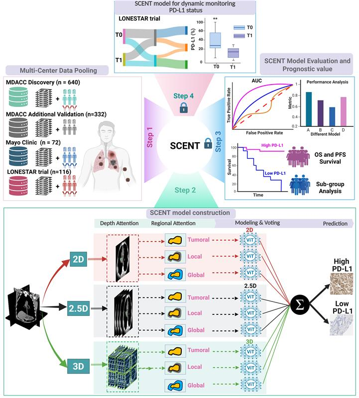
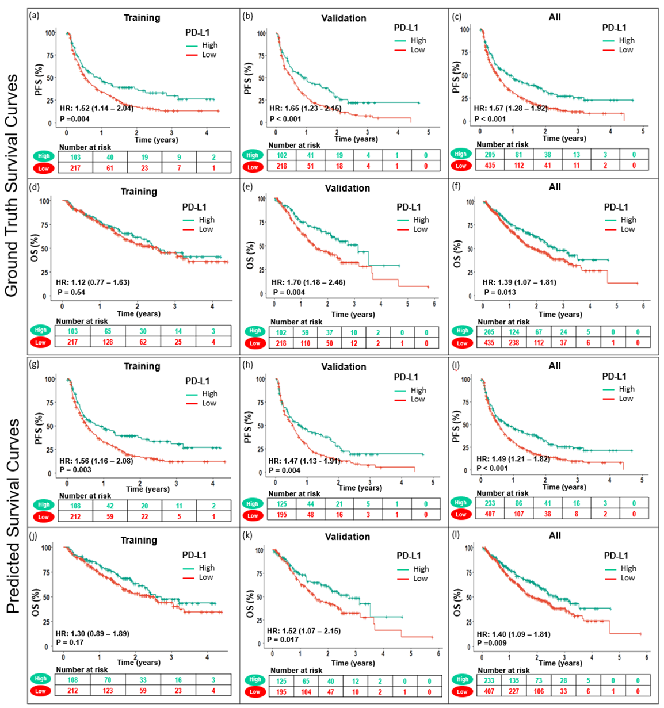

# SCENT: A Deep Learning Framework for PD-L1 Expression Prediction using CT Imaging

**SCENT** (Scalable Ensemble Transformer) is a CT-based deep learning framework that non-invasively predicts PD-L1 expression (≥50% vs <50%) and serves as a biomarker for immunotherapy outcomes in metastatic NSCLC. Trained on paired PD-L1 IHC and CT scans and validated across independent ICI-treated cohorts, SCENT complements tissue IHC while enabling scalable “virtual biopsy” and longitudinal monitoring of treatment response.



## Key Features
- **Non-Invasive PD-L1 Prediction**: Accurately classifies PD-L1 status across biopsy site (AUC=0.84; specificity=83.9%, sensitivity=85.3%).
- **Ensemble Transformer Architecture**: Scalable model design tailored for clinical CT imaging with robust internal validation.
- **Clinical Utility**: SCENT-derived PD-L1 stratifies outcomes—PFS (HR=1.49, p<0.001) and OS (HR=1.40, p=0.009), comparable to IHC-based PD-L1.
- **Joint Stratification with IHC**: Complementary value when combined with tissue IHC; concordant low–low group has the worst outcomes (OS HR=1.45, p=0.008).
- **External Validation**: Generalizes to independent cohorts (AUC=0.80 in Mayo; AUC=0.78 in LONESTAR).
- **Longitudinal Monitoring**: In LONESTAR, baseline and 3-month CTs show dynamic SCENT-predicted PD-L1 shifts aligning with clinical response (odds ratio=0.14; Fisher’s exact p=0.054).

## Installation
To install the **development version** of SCENT using `pip`, run the following command:

```bash
pip install git+https://github.com/WuLabMDA/SCENT.git
```

Alternatively, SCENT can be cloned using the following command:

```bash
git clone https://github.com/WuLabMDA/SCENT.git
cd SCENT
```

## Results
- **Prediction Performance**: SCENT accurately predicts PD-L1 status (≥50% vs <50%) with strong internal performance (AUC=0.84; specificity=83.9%, sensitivity=85.3%) and generalizes to independent cohorts (AUC=0.80 in Mayo; AUC=0.78 in LONESTAR).
- **Clinical Utility**: SCENT-derived PD-L1 stratifies outcomes—PFS (HR=1.49, p<0.001) and OS (HR=1.40, p=0.009)—and complements tissue IHC (worst OS in concordant low–low group, HR=1.45, p=0.008). In LONESTAR, longitudinal baseline→3-month CTs show dynamic PD-L1 shifts aligning with response (odds ratio=0.14; Fisher’s exact p=0.054).



## Citation
If you use this framework, please cite our work:

```bibtex
@article{SCENTPDL1,
  title={Deep Learning of CT Imaging Predicts PD-L1 Expression and Immunotherapy Benefit in Metastatic NSCLC: A Multi-Center Study },
  author={},
  journal={},
  year={Year},
  volume={Volume},
  pages={Pages},
  doi={DOI}
}
```

For questions, contributions, or issues, please contact us or create a new issue in this repository.

## Code Usage Workflow

This repository includes scripts for preparing the imaging data, extracting radiomics features, generating tumor-centered image patches, and training MONAI ViT models for PD-L1 prediction.

The recommended workflow is:

1. Build and run the Docker environment.
2. Run the data summary script.
3. Run the radiomics feature extraction script.
4. Run the tumor slicing script.
5. Train the ViT model.

### 1. Build and Run Docker

First, build the Docker image from the provided `Dockerfile`.

```bash
docker build -t scent:latest .
```

Then run the container with GPU support. Replace the local paths with your own data and code paths.

```bash
docker run --gpus all -it --rm \
    -v /path/to/your/data:/Data \
    -v /path/to/SCENT:/Code \
    scent:latest
```

After entering the container, move to the code directory.

```bash
cd /Code
```

### 2. Create Data Summary Table

The data summary script reads CT images, tumor masks, and the clinical metadata Excel file. It creates a summary table containing patient information, PD-L1 labels, tumor bounding box size, image intensity values inside the tumor, image shape, spacing, and lesion number.

Expected data structure:

```text
RawData/
└── AllCohort/
    ├── Lung/
    │   ├── img/
    │   └── msk/
    ├── Liver/
    │   ├── img/
    │   └── msk/
    └── ...
```

Run:

```bash
python create_data_summary.py \
    --data-root /Data/RawData/AllCohort \
    --metadata-file /Data/Theranostic_surrogate_marker_.xlsx \
    --output-file /Data/DeepLearningBased/AllCohort/DataSummary_Label_v2.xlsx
```

### 3. Extract Radiomics Features

The radiomics extraction script extracts PyRadiomics features from CT images and tumor masks. It supports the original masks and additional expanded masks named `msk_00`, `msk_05`, `msk_10`, ..., `msk_100`.

Expected data structure:

```text
RawData/
└── AllCohort/
    ├── Lung/
    │   ├── img/
    │   └── msk/
    ├── Liver/
    │   ├── img/
    │   └── msk/
    └── RadiousMasks/
        ├── msk_05/
        ├── msk_10/
        └── ...
```

Run:

```bash
python extract_radiomics_features.py \
    --data-root /Data/RawData/AllCohort \
    --params-file /Data/Settings/radiomics_params.yaml \
    --output-dir /Data/RadiomicsFeatures/AllCohort
```

The output will be saved as one CSV file per mask radius.

### 4. Create 2D and 3D Tumor Patches

The slicing script creates tumor-centered 2D and 3D NIfTI patches. It finds the slice with the largest tumor area, crops the tumor region, and saves patches using either zero padding or tissue padding.

Run:

```bash
python slice_tumor_patches.py \
    --data-root /Data/RawData/AllCohort \
    --output-root /Data/DeepLearningBased/AllCohort \
    --modes 2d 3d \
    --depths 3 32 64 128 \
    --wh-size 224 \
    --pad-margins 0 32 64 128
```

The output structure will look like:

```text
DeepLearningBased/
└── AllCohort/
    ├── 2D/
    │   ├── zero_pad/
    │   ├── tissue_pad_32/
    │   ├── tissue_pad_64/
    │   └── tissue_pad_128/
    ├── 3D_3_224_224/
    ├── 3D_32_224_224/
    ├── 3D_64_224_224/
    └── 3D_128_224_224/
```

### 5. Train MONAI ViT Model

The training code supports three input modes.

#### Option A: 2D RGB ViT

Use this for 2D crops or 3-slice crops. The input is converted to 3 channels.

```bash
python train_vit_pdl1.py \
    --data-dir /Data/DeepLearningBased/AllCohort/2D/tissue_pad_32 \
    --metadata-file /Data/Theranostic_surrogate_marker_.xlsx \
    --output-root /Data/outputs \
    --vit-mode 2d_rgb \
    --target-mode twoclass \
    --train-batch-size 16 \
    --val-batch-size 16 \
    --test-batch-size 16 \
    --devices 0
```

#### Option B: 2D ViT Using Depth as Channels

Use this when the input is a 32, 64, or 128 slice crop and you want to use a 2D ViT. The full depth is treated as image channels.

Example for 32-slice input:

```bash
python train_vit_pdl1.py \
    --data-dir /Data/DeepLearningBased/AllCohort/3D_32_224_224/tissue_pad_32 \
    --metadata-file /Data/Theranostic_surrogate_marker_.xlsx \
    --output-root /Data/outputs \
    --vit-mode 2d_channels \
    --input-depth 32 \
    --target-mode twoclass \
    --train-batch-size 8 \
    --val-batch-size 8 \
    --test-batch-size 8 \
    --devices 0
```

#### Option C: True 3D ViT

Use this when the input is a 3D crop and you want to train a true 3D ViT.

```bash
python train_vit_pdl1.py \
    --data-dir /Data/DeepLearningBased/AllCohort/3D_32_224_224/tissue_pad_32 \
    --metadata-file /Data/Theranostic_surrogate_marker_.xlsx \
    --output-root /Data/outputs \
    --vit-mode 3d \
    --input-depth 32 \
    --spatial-size 192 \
    --patch-size-3d 16 96 96 \
    --target-mode twoclass \
    --train-batch-size 2 \
    --val-batch-size 2 \
    --test-batch-size 2 \
    --devices 0
```

For true 3D ViT, the image size must be divisible by the patch size. Because 224 is not divisible by 96, the script uses `192 × 192` spatial size for the true 3D ViT example.

### Main Output Files

After running the workflow, the main outputs are:

```text
DataSummary_Label_v2.xlsx
RadiomicsFeatures/
DeepLearningBased/
outputs/
├── checkpoints/
├── lightning_logs/
└── predictions/
```

The prediction CSV file contains the subject ID, true label, predicted label, cohort assignment, class probabilities, and logits.

### Notes

The scripts do not include local hard-coded paths. All input and output locations should be passed using command line arguments.

The default target is binary PD-L1 classification using `twoclass`.

The metadata Excel file should contain at least these columns:

```text
NewID
Site_cat
PD_L1Expression
PFSStatus
PFS
OSStatus
OS
```
